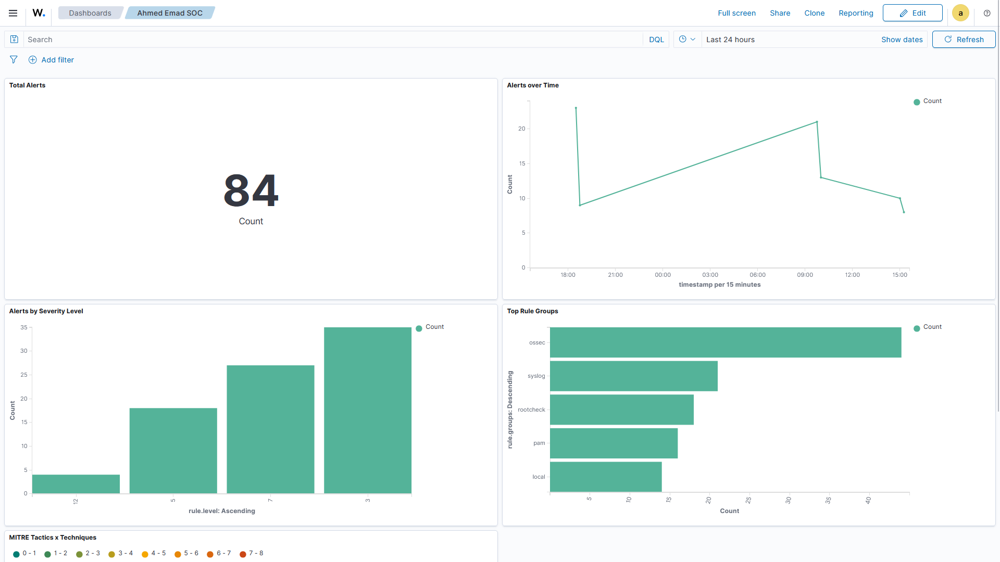
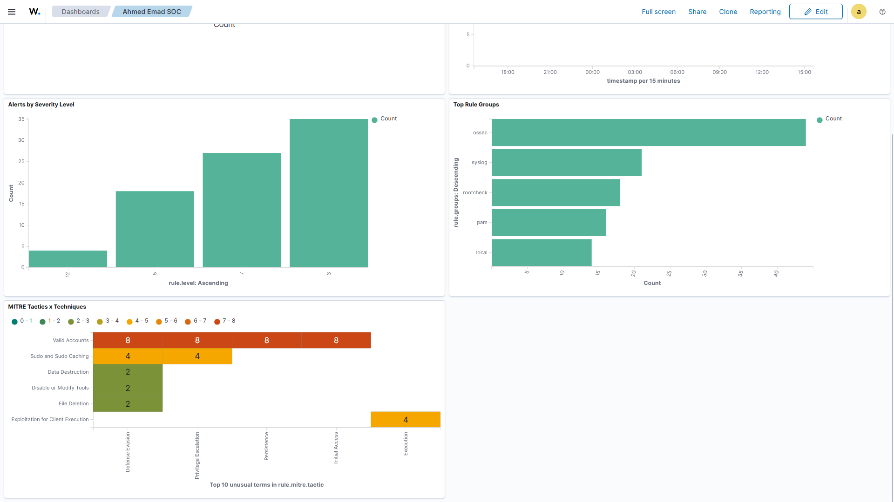
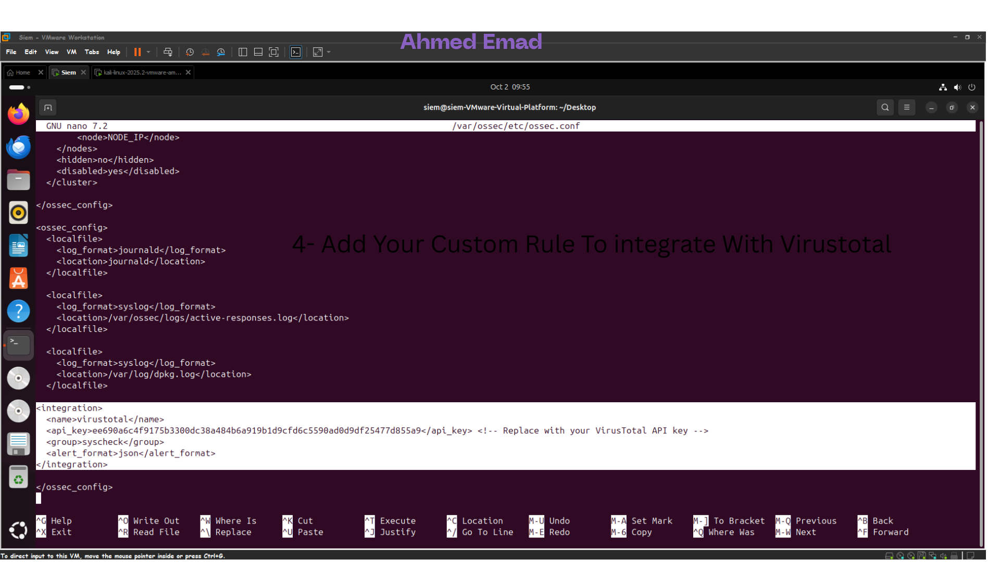
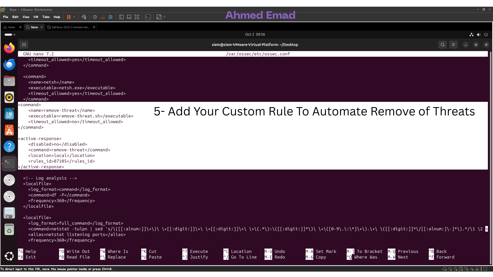
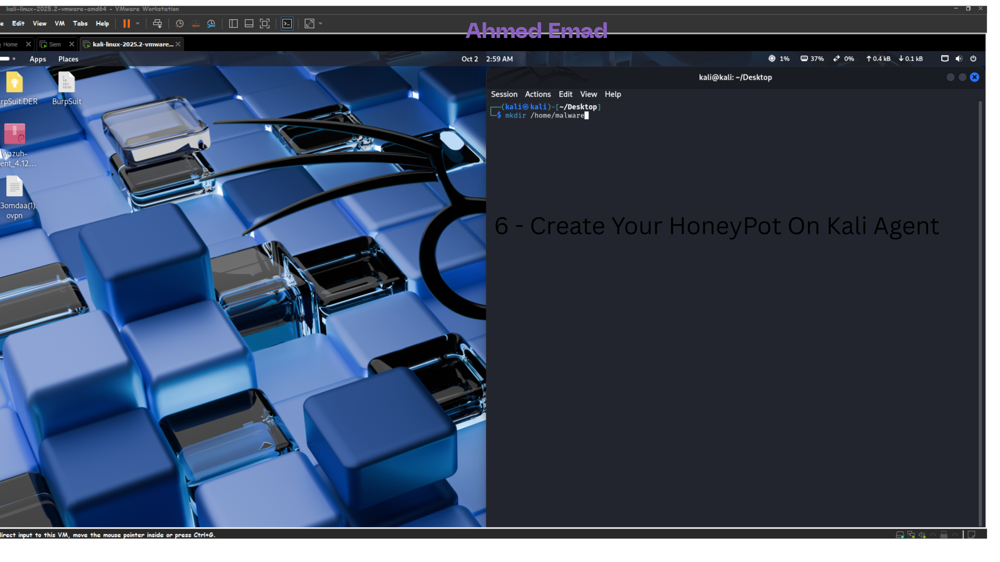

# 🛡️ Mini SOC with Automated Suspicious Behavior Detection  
### By **Ahmed Emad Eldeen Abdelmoneam**

Using **Wazuh SIEM**, **Atomic Red Team**, & **VirusTotal Auto-Removal (Linux)**

---

## 📑 Table of Contents
- [Authors & Contributions](#-authors--contributions)
- [Introduction](#-introduction)
- [Objectives](#-objectives)
- [Architecture & Flow](#-architecture--flow)
- [Summary of Simulated Attacks](#-summary-of-simulated-attacks)
- [Proof of Concept Overview](#-mini-soc--proof-of-concept-overview)
- [Detection Effectiveness](#-detection-effectiveness-of-the-siem)
- [Areas for Improvement](#-areas-for-improvement)
- [Screenshots](#-screenshots)
- [Conclusion](#-conclusion)
- [License](#-license)

---

## 👨‍💻 Authors & Contributions

**SOC Team Lead:**  
👤 **Ahmed Emad Eldeen Abdelmoneam**

<table>
  <tr>
    <td>
      <ul>
        <li>🔗 <b>LinkedIn:</b> <a href="https://www.linkedin.com/in/0x3omda/">linkedin.com/in/0x3omda</a></li>
        <li>🌐 <b>Portfolio:</b> <a href="https://eng-ahmed-emad.github.io/AhmedEmad-Dev/">Portfolio</a></li>
      </ul>
    </td>
    <td></td>
    <td></td>
  </tr>
</table>

---

## 📖 Introduction
This project establishes a **Mini SOC** leveraging:  
- **Wazuh SIEM** for centralized monitoring and alerting  
- **Atomic Red Team** for simulating adversary techniques mapped to MITRE ATT&CK  
- **VirusTotal API Integration** for automated malicious file detection & removal  

🎯 The main goal is to **assess and enhance detection capabilities** of the SOC against real-world suspicious behaviors while enabling **automated containment workflows**.

---

## 🎯 Objectives
- ✅ Simulate real-world cyberattacks to test SOC detection effectiveness  
- ✅ Automate continuous malicious behavior across network environments  
- ✅ Integrate VirusTotal with Wazuh for **auto-quarantine of malicious files**  
- ✅ Enable **real-time File Integrity Monitoring (FIM)** 24/7  

---

## 🏗️ Architecture & Flow
1. **Hosts:** Windows & Ubuntu machines generate normal and malicious activity  
2. **Atomic Red Team:** Executes automated attack simulations  
3. **Wazuh SIEM:** Collects logs, applies correlation rules, and triggers alerts  
4. **VirusTotal Integration:** Files in `/home/malware` are scanned → malicious files are automatically quarantined or removed  

### 🧩 System Architecture Diagram

  

---

## 🔥 Summary of Simulated Attacks
Simulated adversarial techniques using **Atomic Red Team** include:

- 🔑 **Brute Force Login Attempts**  
- 🔺 **Privilege Escalation (Linux sudo misuse)**  
- 🦠 **Malware Execution (scripts & binaries)**  
- 📤 **Data Exfiltration (suspicious outbound traffic)**  
- 💉 **Process Injection (Windows host)**  

Each attack was scheduled via **cron (Linux)** and **Task Scheduler (Windows)** to mimic **continuous malicious activity**.

---

# 🛡️ Mini SOC – Proof of Concept Overview

## ⚙️ Core Stack
- **Wazuh Manager**
- **Wazuh Agents** (Windows & Linux)
- **Suricata** (Network IDS Sensor)
- **File Integrity Monitoring (FIM)**

---

## 🧩 Detection
- Custom **Wazuh decoders** & **local rules**
- **Suricata → Wazuh** correlation rules
- **Custom exfiltration detection** logic
- **Atomic Red Team → MITRE ATT&CK** mapping

---

## 🚨 Response
- **VirusTotal v3** integration
- **Auto-quarantine** (forensic copy)
- **Auto-delete** *(optional)*
- **Active Response registration** (Wazuh)
- **Auto-block IP / Firewall block**
- **Endpoint isolation** *(manual or automated)*

---

## 🤖 Automation & Testing
- **Atomic Red Team orchestration** (scheduled)
- **Test harness & validation scripts**
- **VirusTotal cache** (SQLite)

---

## 📊 Observability & Dashboards
- **Kibana / Wazuh custom dashboards**
- **Alerting integrations** (Slack / Email / PagerDuty)
- **Metrics & reporting** (MTTR, detection times, FP rates)

---

## 🧾 Forensics & Audit
- **Forensic preservation workflow**
- **Audit logs** of auto-removal actions

---

## 🛡️ Hardening, Ops & Governance
- **RBAC** & multi-tenant views  
- **Rate-limit handling** & API key management  
- **Playbooks / Runbooks** (IR playbooks)

---

## ✨ Extras / Nice-to-Have
- **Auto-enrichment** (VirusTotal + OSINT)  
- **Machine Learning anomaly detection (PoC)**  
- **GUI / Web UI** for quarantine review  

---

## ✅ Implementation Checklist
- [x] **Wazuh Manager** installed & configured  
- [x] **Wazuh Agents** on Windows & Linux  
- [x] **Suricata sensor** + `eve.json` forwarding to Wazuh  
- [x] **FIM** enabled for `/home/malware` and Windows directories  
- [x] **Active Response** script: `vt-file-check` *(with cache)*  
- [x] **Quarantine workflow** (forensic copy)  
- [ ] **Auto-delete** *(disabled by default)*  
- [x] **Wazuh decoders & local_rules** for Suricata & FIM  
- [x] **Correlation rules** (Suricata + host events)  
- [x] **Atomic Red Team** scheduled tests  
- [x] **Dashboards** exported (Kibana / Wazuh)  
- [x] **Alerting integrations** (Slack / Email)  
- [x] **Forensics collector + metadata**  
- [x] **Documentation:** playbooks, runbooks, secrets handling  
- [x] **Tests:** PoC run script + alert collection  

---

## 🧭 Priority Levels
| Priority | Focus Areas |
|-----------|--------------|
| 🔴 **High** | Core stack, FIM, Active Response (VT + quarantine), Decoders & Correlation |
| 🟠 **Medium** | Atomic scheduling, Dashboards, Reporting, Auto-block / Isolation (requires governance) |
| 🟢 **Low** | ML module, Full GUI interface |

---

> 🚀 *This PoC demonstrates an automated Mini SOC pipeline integrating detection, response, and observability through Wazuh, Suricata, and VirusTotal for efficient threat containment.*

---

## 📊 Detection Effectiveness of the SIEM
- **Brute Force:** Detected multiple failed login attempts  
- **Privilege Escalation:** Unauthorized sudo flagged  
- **Malware Execution:** Suspicious processes & binaries detected  
- **Data Exfiltration:** Outbound anomalies flagged via custom rules  
- **Process Injection:** Windows injection attempts detected in real-time  
- **VirusTotal:** Confirmed malware auto-removed + alert generated  

📌 **Overall:** High detection accuracy and strong containment with minimal manual intervention.  

---

## 🚧 Areas for Improvement
- 🎚 **Fine-tune thresholds** to reduce false positives  
- 🔗 **Improve correlation** between multi-stage attacks  
- 📡 **Enhance exfiltration detection** with DPI / anomaly rules  
- 🧪 **Expand attack coverage** with lateral movement & persistence techniques  
- 🤖 **Further automation:** auto-block IPs & isolate endpoints  

---

## 📸 Screenshots

### 🛠 Custom Dashboard
<table>
  <tr>
    <td></td>
    <td></td>
  </tr>
</table>

---

### 🦠 VirusTotal Auto-Removal
<table>
  <tr>
    <td></td>
    <td></td>
    <td></td>
  </tr>
  <tr>
    <td></td>
    <td></td>
    <td></td>
  </tr>
</table>

---

### 📂 File Integrity Monitoring (Windows)
<table>
  <tr>
    <td></td>
    <td></td>
  </tr>
  <tr>
    <td></td>
    <td></td>
  </tr>
</table>

---

## ✅ Conclusion
This **Mini SOC** proved effective in detecting and containing a wide variety of attacks with **strong automation capabilities**.  
By enhancing correlation, fine-tuning thresholds, and expanding attack simulations, the SOC can evolve into a **robust detection, response, and 24/7 monitoring ecosystem**.

---

## 📜 License
This project is licensed under the [MIT License](LICENSE).  
© 2025 **Ahmed Emad Eldeen Abdelmoneam**

---
