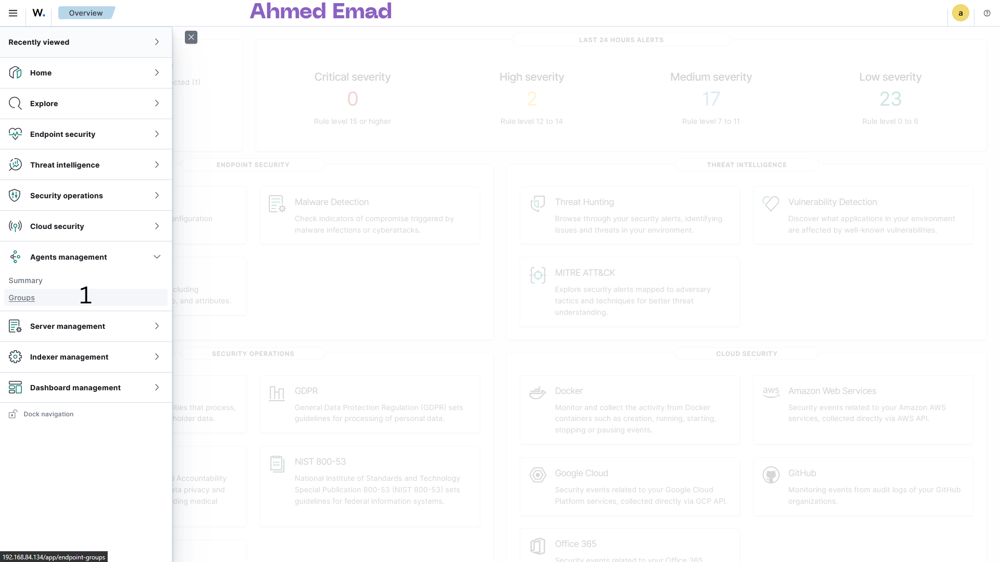
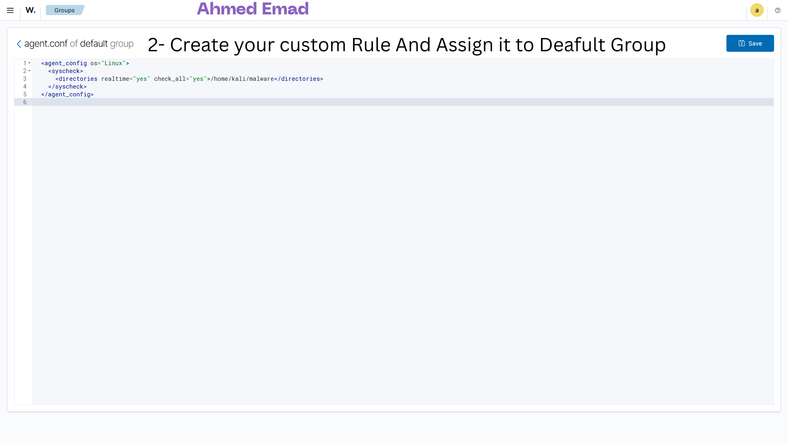

# Mini SOC with Automated Suspicious Behavior Detection Using Atomic Red Team + VirusTotal Integration for Malicious File Auto-Removal (Linux)

## Authors & Contributions

**SOC Team Lead:**  
👤 **Ahmed Emad Eldeen Abdelmoneam**

<table>
  <tr>
    <td>
      <ul>
        <li>🔗 <b>LinkedIn:</b> <a href="https://www.linkedin.com/in/0x3omda/">linkedin.com/in/0x3omda/</a></li>
        <li>🌐 <b>Portfolio:</b> <a href="https://eng-ahmed-emad.github.io/AhmedEmad-Dev/">Portfolio</a></li>
      </ul>
    </td>
    <td>
      
    </td>
  </tr>
</table>

## Screenshots
## Demo Video

[

### VirusTotal Auto-Removal

### VirusTotal Auto-Removal2

## Introduction
The Mini SOC project aims to establish a basic Security Operations Center (SOC) that utilizes the **Wazuh SIEM solution**, **Atomic Red Team** for simulating various cyberattack techniques, and **VirusTotal integration** for automated malicious file detection and removal. This initiative is designed to assess the detection capabilities of the SOC against suspicious behaviors and threats, employing techniques mapped to the MITRE ATT\&CK framework while also introducing automated file response workflows.

## Objectives

**The primary objectives of the project are:**

* To simulate real-world cyberattack scenarios to evaluate the effectiveness of the SOC's detection capabilities.
* To automate attack simulations to mimic continuous malicious behavior across network environments.
* To integrate VirusTotal with Wazuh so that any file created inside `/home/malware` is automatically scanned, and if identified as malicious, it is quarantined or deleted.

## Summary of Simulated Attacks

Throughout the project, we executed multiple Atomic Red Team tests designed to simulate various attack techniques mapped to the MITRE ATT\&CK framework. These attack simulations covered a wide range of suspicious activities to test the SOC's detection capabilities. Below are the key attack types simulated:

* **Brute Force Login Attempts:** Simulated repeated failed login attempts on both Windows and Ubuntu hosts, which mirror password-guessing attacks by malicious actors.
* **Privilege Escalation:** Unauthorized privilege escalation attempts on the Ubuntu host were simulated using sudo commands without proper credentials to test how the system responds to potential unauthorized administrative access.
* **Malware Execution:** We executed malicious binaries and scripts on both hosts to test how the system detects and reacts to known malware patterns.
* **Data Exfiltration:** Simulated file exfiltration through suspicious outbound network traffic, testing the system's ability to detect data being sent out of the network.
* **Process Injection:** Conducted process injection on the Windows host, mimicking an attacker’s attempt to inject code into legitimate processes to hide malicious activity.

Each of these attacks was scheduled via cron jobs on Ubuntu and Task Scheduler on Windows, automating their execution at set intervals to simulate continuous malicious behavior across the network.

## VirusTotal Integration

In addition to the simulated attacks, we implemented **integration between Wazuh and VirusTotal** to enhance malware detection and automated response:

* **File Monitoring:** Wazuh File Integrity Monitoring (FIM) was configured to watch the `/home/malware` directory.
* **Triggering Event:** When a new file is created or modified, Wazuh triggers an **Active Response script**.
* **VirusTotal Scan:** The script calculates the file hash (SHA256) and queries the VirusTotal API for reputation analysis.
* **Automatic Removal:** If VirusTotal identifies the file as malicious (based on detection threshold), the file is automatically quarantined or deleted.
* **Alerting:** Wazuh generates alerts to notify the SOC team of the detection and action taken.

This integration provides an automated malware containment workflow, reducing manual intervention and improving incident response times.

## Detection Effectiveness of the SIEM

The SIEM solution, Wazuh, was effective in detecting a wide range of suspicious activities based on the logs received from both the Windows and Ubuntu hosts. Here's how it performed against the specific attacks:

* **Brute Force Login Attempts:**

  * The SIEM successfully detected multiple failed login attempts on both hosts.
  * Alerts were generated whenever a predefined threshold of failed logins was crossed, making it effective for brute force attack detection.
* **Privilege Escalation:**

  * Unauthorized use of sudo on the Ubuntu host was accurately flagged by the SIEM.
  * Wazuh's predefined rule set for privilege escalation worked effectively, raising alerts for any unauthorized or abnormal sudo activity.
* **Malware Execution:**

  * The execution of malicious scripts was logged, and Wazuh generated alerts for known suspicious process behavior, such as the execution of untrusted scripts or binaries.
* **Data Exfiltration:**

  * Suspicious network traffic indicating data exfiltration attempts was flagged, especially outbound traffic that matched the patterns of sensitive file transfers.
  * Custom rules for monitoring outbound network activity helped in identifying unusual traffic behavior.
* **Process Injection:**

  * The SIEM accurately detected the process injection on the Windows host.
  * Wazuh flagged unusual behavior where a legitimate process was tampered with, sending real-time alerts.
* **VirusTotal File Integration:**

  * Successfully detected malicious files created in `/home/malware`.
  * Automated scanning with VirusTotal improved detection accuracy by leveraging multi-engine antivirus results.
  * Automatic quarantine/deletion of confirmed malicious files enhanced containment capabilities and reduced manual workload.

**Overall Detection Rate:** The SIEM was able to detect and alert the SOC team for most attack simulations with a high degree of accuracy. Alerts were triggered based on pre-configured rules for unauthorized access, suspicious network traffic, unusual process behavior, and VirusTotal-confirmed malware.

## Areas for Improvement

Despite the success in detecting attacks, there are a few areas that require fine-tuning and improvement for better efficiency and to reduce false positives:

* **Tuning Detection Thresholds:**

  * Some legitimate system activities, particularly administrative tasks on both the Windows and Ubuntu hosts, triggered false positives. Detection thresholds, particularly for login attempts and system modifications, should be fine-tuned to reduce noise and focus on genuine threats.
  * For example, increasing the threshold for failed login attempts to detect only excessive, rapid attempts would cut down on unnecessary alerts.
* **Improving Log Correlation:**

  * While Wazuh successfully identified individual events, there is room for improvement in correlating multiple events across hosts. Creating correlation rules that connect related events (e.g., brute force login attempts followed by privilege escalation) could help build a clearer timeline of attack sequences.
  * Advanced correlation would allow better context in identifying coordinated attacks.
* **Enhancing Data Exfiltration Detection:**

  * Although data exfiltration was detected through anomalous outbound traffic, implementing deeper packet inspection (DPI) or enhanced network anomaly detection rules would improve the SIEM’s ability to catch more sophisticated data theft attempts.
  * This would help distinguish between legitimate large file transfers and potential data exfiltration.
* **Attack Variety Expansion:**

  * The variety of Atomic Red Team tests can be expanded to include more complex and stealthy attack techniques (e.g., lateral movement, persistence mechanisms) to further stress-test the SIEM's capabilities.
  * Increasing the range of simulated attacks will give a more comprehensive picture of the SIEM’s effectiveness.
* **Further Automation:**

  * While we successfully automated attack simulations and file scanning, adding more sophisticated automation tools and running more frequent simulations could enhance the real-world readiness of the SOC.
  * Automating log analysis and response actions (such as blocking IP addresses upon detection of brute force attacks or isolating endpoints upon malware detection) could improve response times.

## Conclusion

The Mini SOC, using Wazuh as the SIEM solution, Atomic Red Team for attack simulations, and VirusTotal integration for malicious file auto-removal, was able to detect a wide range of suspicious activities and attacks with a high level of accuracy. The VirusTotal integration provided an additional layer of defense by automating malware scanning and containment. However, improvements in detection thresholds, log correlation, and advanced monitoring for more subtle attack techniques will further enhance the SOC's effectiveness. Continuous tuning, expanding attack simulation scenarios, and refining automated responses will provide even better coverage against potential threats.
