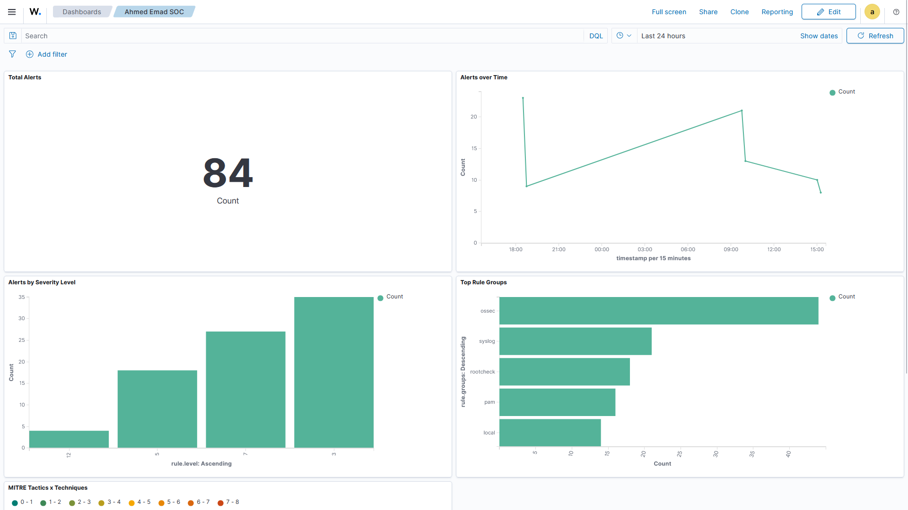
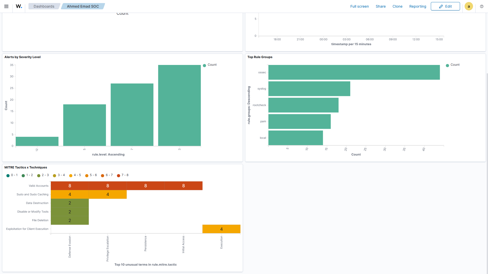

# 🛡️ SOC Enviroment with Automated Suspicious Behavior Detection  
### By **Ahmed Emad Eldeen Abdelmoneam**

Using **Wazuh SIEM and EDR**, **Atomic Red Team**, **YARA**, **Suricata (IDS)**  **VirusTotal Auto-Removal**,**Custom Rules By 3omda** , **SocSOCFortress Wazuh Rules**

<!-- Badges row -->

<!-- Tool / project badges -->

<!-- Added badges -->

<!-- Optional: logos row using project assets (uncomment & add files under assets/logos/) -->
<!--

  
  
  
  

-->

---

## 📑 Table of Contents
- [Authors & Contributions](#-authors--contributions)
- [Introduction](#-introduction)
- [Objectives](#-objectives)
- [Architecture & Flow](#-architecture--flow)
- [Summary of Simulated Attacks](#-summary-of-simulated-attacks)
- [Proof of Concept Overview](#-mini-soc--proof-of-concept-overview)
- [Detection Effectiveness](#-detection-effectiveness-of-the-siem)
- [Areas for Improvement](#-areas-for-improvement)
- [Screenshots](#-screenshots)
- [Conclusion](#-conclusion)
- [License](#-license)

---

## 👨‍💻 Authors & Contributions

**SOC Team Lead:**  
👤 **Ahmed Emad Eldeen Abdelmoneam**

<table>
  <tr>
    <td>
      <ul>
        <li>🔗 <b>LinkedIn:</b> <a href="https://www.linkedin.com/in/0x3omda/">linkedin.com/in/0x3omda</a></li>
        <li>🌐 <b>Portfolio:</b> <a href="https://eng-ahmed-emad.github.io/AhmedEmad-Dev/">Portfolio</a></li>
      </ul>
    </td>
    <td></td>
    <td></td>
  </tr>
</table>

---
## 🎥 Video Walkthroughs

### Configuration Walkthrough (Setup & Integration)
For a complete step-by-step walkthrough of the **Mini SOC configuration** — installing and configuring Wazuh, Suricata, YARA, VirusTotal integration, FIM, and hardening — watch the configuration playlist:  
📺 **Mini SOC Configuration – Full Setup Guide:**  
https://youtube.com/playlist?list=PLO1VSSKnwZUgbiE0ev1TUr5wPI9kxxbgL&si=QNR9F35Cbg-k5n7gL

> Use this playlist while following the `Implementation Checklist` to replicate the PoC environment.

### Attack Simulation Walkthrough (Adversary Emulation)
This playlist demonstrates the **attack simulations** you run with Atomic Red Team (live demos, technique mapping to MITRE ATT&CK, and detection validation):  
📺 **Attack Simulation & Adversary Emulation:**  
https://youtube.com/playlist?list=PLO1VSSKnwZUgdrITjagQD0mikt6Xk64yX&si=wtfoNsnj01SVFzJa

---

## 📖 Introduction
This project establishes a **Mini SOC** leveraging:  
- **Wazuh SIEM** for centralized monitoring and alerting  
- **Atomic Red Team** for simulating adversary techniques mapped to MITRE ATT&CK  
- **VirusTotal API Integration** for automated malicious file detection & removal  
- **Suricata IDS** for real-time network traffic analysis and intrusion detection
- **YARA** for file-based threat hunting and malware signature matching
- **System Auditing and Logging** on both Linux and Windows to enhance visibility and traceability
- **Firewall Hardening** for Linux (iptables/ufw) and Windows Defender Firewall to strengthen perimeter defenses
🎯 The main goal is to **assess and enhance detection capabilities** of the SOC against real-world suspicious behaviors while enabling **automated containment workflows**.

---

## 🎯 Objectives
- ✅ **Simulate real-world cyberattacks** using Atomic Red Team to test SOC detection and response effectiveness  
- ✅ **Automate continuous malicious behavior simulation** across diverse network environments (for testing and tuning)  
- ✅ **Integrate VirusTotal API with Wazuh** to enable automated detection and **auto-quarantine of malicious files**  
- ✅ **Enable real-time File Integrity Monitoring (FIM)** 24/7 and correlate FIM events with SIEM alerts  
- ✅ **Deploy and fine-tune Suricata IDS** for deep packet inspection and network-based threat detection  
- ✅ **Utilize YARA rules** for advanced file scanning and customizable malware identification  
- ✅ **Implement system auditing and centralized logging** to enhance endpoint and OS-level visibility (Linux & Windows)  
- ✅ **Harden firewalls and apply secure baselines** across hosts to reduce attack surface and false positives

---

## 🏗️ Architecture & Flow
1. **Hosts (Windows & /linux):** Generate both normal and simulated malicious activities to emulate a real-world enterprise network.  
2. **Atomic Red Team:** Executes automated adversary simulations mapped to **MITRE ATT&CK** tactics and techniques.  
3. **Suricata IDS:** Monitors network traffic in real-time, detecting suspicious patterns and sending alerts to **Wazuh**.  
4. **Wazuh SIEM:** Collects logs from endpoints and network devices, correlates security events, and triggers alerts for further investigation.  
5. **YARA Integration:** Scans system files and directories (e.g., `/home/ahmed/ahmed`) for malware signatures and anomalous content.  
6. **VirusTotal API Integration:** Submits detected files to VirusTotal for verification — malicious files are automatically quarantined or removed.  
7. **Auditing & Logging:** Linux and Windows auditing policies ensure visibility of user activities, file access, and privilege escalations.  
8. **Firewall Hardening:** Linux (iptables/ufw) and Windows firewalls are configured to enforce least privilege and restrict lateral movement.

> This architecture demonstrates the workflow of a functional **Mini SOC**, integrating host-based, network-based, and cloud-based threat intelligence into one unified detection and response pipeline.

### 🧩 System Architecture Diagram

  

---

## 🔥 Summary of Simulated Attacks
Simulated adversarial techniques using **Atomic Red Team** include:

- 🔑 **Brute Force Login Attempts**  
- 🔺 **Privilege Escalation (Linux sudo misuse)**  
- 🦠 **Malware Execution (scripts & binaries)**  
- 📤 **Data Exfiltration (suspicious outbound traffic)**  
- 💉 **Process Injection (Windows host)**  

Each attack was scheduled via **cron (Linux)** and **Task Scheduler (Windows)** to mimic **continuous malicious activity**.

---

# 🛡️ Mini SOC — Proof of Concept Overview

> مشروع Mini SOC بغرض التعلم والاختبار في بيئة مختبرية مسيطر عليها. لا تستخدم أدوات الهجوم خارج بيئة قانونية وأخلاقية.

## ⚙️ Core Stack
- **Wazuh Manager**  
- **Wazuh Agents** (Windows & Linux)  
- **Suricata** (Network IDS sensor, `eve.json` → Wazuh)  
- **File Integrity Monitoring (FIM)** (Linux & Windows)  
- **YARA** (file-based threat hunting)  
- **VirusTotal v3 API** (threat intelligence / file verdicts)

---

## 🧩 Detection
- Custom **Wazuh decoders** & **local_rules**  
- **Suricata → Wazuh** correlation rules (network ↔ host fusion)  
- **YARA scanning** + FIM correlation  
- **Custom exfiltration detection** logic (data transfer heuristics)  
- **Atomic Red Team → MITRE ATT&CK** mapping for repeatable test cases  
- **SOCFortress Wazuh Rules (Partial Integration)** — imported and tuned to enhance detection coverage across multiple MITRE ATT&CK techniques (e.g., T1059 Command Execution, T1003 Credential Dumping, T1078 Valid Accounts).  
  These rules expand Wazuh’s native capabilities and provide better visibility into suspicious PowerShell, Sysmon, and Windows event logs.  
  🔗 [SOCFortress Wazuh Rules Repository](https://github.com/socfortress/Wazuh-Rules)

---

## 🚨 Response
- **VirusTotal v3** integration for file enrichment and verdicts  
- **Auto-quarantine** workflow (forensic copy)  
- **Auto-delete** *(optional — disabled by default)*  
- **Wazuh Active Response** registration (e.g., `vt-file-check`)  
- **Auto-block IP / Firewall block** (iptables/ufw, Windows Defender Firewall)  
- **Endpoint isolation** (manual or automated)  

---

## 🤖 Automation & Testing
- **Atomic Red Team orchestration** (scheduled tests)  
- **Test harness & validation scripts** (PoC scripts + alert collection)  
- **VirusTotal cache** (SQLite) to reduce API usage and rate-limit impact

---

## 📊 Observability & Dashboards
- **Kibana / Wazuh custom dashboards** (detections, FIM events, Suricata alerts)  
- **Alerting integrations** (Slack / Email / PagerDuty)  
- **Metrics & reporting:** MTTR, detection times, false-positive rates, coverage

---

## 🧾 Forensics & Audit
- **Forensic preservation workflow** (hashing, immutable copies)  
- **Audit logs** of auto-removal/quarantine actions and analyst decisions  
- **Chain-of-custody** metadata stored with artifacts

---

## 🛡️ Hardening, Ops & Governance
- **RBAC** & multi-tenant views in Wazuh/Kibana  
- **Rate-limit handling** & API key management for VirusTotal  
- **Playbooks / Runbooks** (IR playbooks for common scenarios)  
- **Baselines & hardening**: OS-level hardening for Linux & Windows, firewall policies

---

## ✨ Extras / Nice-to-Have
- **Auto-enrichment** (VirusTotal + OSINT feeds)  
- **Machine Learning anomaly detection (PoC)**  
- **GUI / Web UI** for quarantine review and analyst workflows

---

## ✅ Implementation Checklist
- [x] **Wazuh Manager** installed & configured  
- [x] **Wazuh Agents** on Windows & Linux  
- [x] **Suricata sensor** + `eve.json` forwarding to Wazuh  
- [x] **FIM** enabled for `/home/ahmed/ahmed` and Windows monitored directories  
- [x] **YARA rules** deployed for file scanning  
- [x] **Active Response** script: `vt-file-check` *(with cache)*  
- [x] **Quarantine workflow** (forensic copy implemented)  
- [ ] **Auto-delete** *(disabled by default — checkbox to enable if desired)*  
- [x] **Wazuh decoders & local_rules** for Suricata & FIM events  
- [x] **Correlation rules** (Suricata + host events)  
- [x] **Atomic Red Team** scheduled tests & mappings  
- [x] **Dashboards** exported (Kibana / Wazuh)  
- [x] **Alerting integrations** (Slack / Email)  
- [x] **Forensics collector + metadata pipeline**  
- [x] **Documentation:** playbooks, runbooks, secrets handling  
- [x] **Tests:** PoC run script + alert collection
- [x] **SOCFortress Wazuh Rules** (partially imported and tuned)

---

## Notes / ملاحظات قصيرة
- Configure VirusTotal API key securely (use secrets manager, avoid hardcoding).  
- Limit auto-delete — prefer quarantine + manual analyst review to avoid data loss.  
- Keep a local cache to reduce API calls and avoid hitting VT rate limits.  
- هذا المشروع مخصص لبيئات اختبار فقط — التزم بسياسات المؤسسة والقوانين المحلية.

---

## 🧭 Priority Levels
| Priority | Focus Areas |
|-----------|--------------|
| 🔴 **High** | Core stack, FIM, Active Response (VT + quarantine), Decoders & Correlation |
| 🟠 **Medium** | Atomic scheduling, Dashboards, Reporting, Auto-block / Isolation (requires governance) |
| 🟢 **Low** | ML module, Full GUI interface |

---

> 🚀 *This PoC demonstrates an automated Mini SOC pipeline integrating detection, response, and observability through Wazuh, Suricata, and VirusTotal for efficient threat containment.*

---

## 📊 Detection Effectiveness of the SIEM
- **Brute Force:** Multiple failed login attempts detected and correlated across Windows and Linux endpoints.  
- **Privilege Escalation:** Unauthorized `sudo` execution flagged via audit logs and Wazuh rules.  
- **Malware Execution:** Suspicious binaries and processes detected through **YARA scanning** and **FIM correlation**.  
- **Data Exfiltration:** Outbound anomalies and unusual data transfer patterns identified using **custom Wazuh + Suricata correlation rules**.  
- **Process Injection:** Real-time detection of Windows process injection attempts via Sysmon event logs.  
- **VirusTotal Integration:** Malicious files verified by VirusTotal API were **auto-quarantined or removed**, with alert generation and forensic copy retained.  

📌 **Overall:** Achieved **high detection accuracy**, **strong automation**, and **minimal manual intervention** — validating the SOC’s ability to respond to real-world adversarial techniques.  

---

## 🚧 Areas for Improvement
- 🎚 **Fine-tune detection thresholds** to reduce false positives and redundant alerts.  
- 🔗 **Enhance correlation logic** between multi-stage attack chains (initial access → persistence → lateral movement).  
- 📡 **Improve data exfiltration detection** using Deep Packet Inspection (DPI) and anomaly-based detection models.  
- 🧪 **Expand attack coverage** by simulating advanced techniques (persistence, credential dumping, privilege escalation).  
- 🤖 **Increase automation** — integrate IP auto-blocking, endpoint isolation, and alert enrichment pipelines.  

---

## 📸 Screenshots

### 🛠 Custom Dashboards
<table>
  <tr>
    <td></td>
    <td></td>
  </tr>
</table>

> Example Wazuh & Kibana dashboards showing correlated Suricata alerts, VirusTotal verdicts, and automated response events.

---

## ✅ Conclusion
This **Mini SOC** effectively demonstrated strong **threat detection**, **automated response**, and **SIEM correlation** capabilities.  
By refining correlation logic, expanding adversary simulation coverage, and improving response automation, this PoC can evolve into a **fully operational SOC environment** capable of **real-time monitoring, incident response, and threat hunting**.

---

## 📜 License
This project is licensed under the [MIT License](LICENSE).  
© 2025 **Ahmed Emad Eldeen Abdelmoneam**

---
