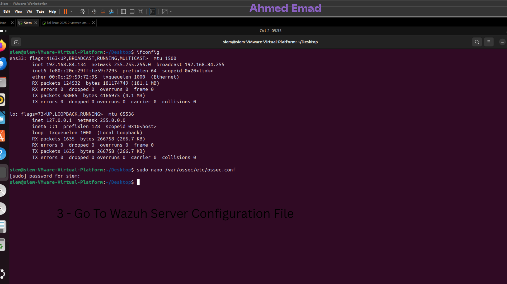

# 🛡️ Mini SOC with Automated Suspicious Behavior Detection  By Ahmed Emad
### Using **Wazuh SIEM**, **Atomic Red Team**, & **VirusTotal Auto-Removal (Linux)**

  
  
  

---

## 📑 Table of Contents
- [Authors & Contributions](#authors--contributions)
- [Introduction](#introduction)
- [Objectives](#objectives)
- [Architecture & Flow](#architecture--flow)
- [Summary of Simulated Attacks](#summary-of-simulated-attacks)
- [VirusTotal Integration](#virustotal-integration)
- [Detection Effectiveness](#detection-effectiveness-of-the-siem)
- [Areas for Improvement](#areas-for-improvement)
- [Screenshots](#-screenshots)
- [Conclusion](#conclusion)
- [License](#license)

---

## 👨‍💻 Authors & Contributions

**SOC Team Lead:**  
👤 **Ahmed Emad Eldeen Abdelmoneam**

<table>
  <tr>
    <td>
      <ul>
        <li>🔗 <b>LinkedIn:</b> <a href="https://www.linkedin.com/in/0x3omda/">linkedin.com/in/0x3omda</a></li>
        <li>🌐 <b>Portfolio:</b> <a href="https://eng-ahmed-emad.github.io/AhmedEmad-Dev/">Portfolio</a></li>
      </ul>
    </td>
    <td>
      
    </td>
    <td>
      
    </td>
  </tr>
</table>

---

## 📖 Introduction
This project establishes a **Mini SOC** leveraging:  
- **Wazuh SIEM** for centralized monitoring and alerting  
- **Atomic Red Team** for simulating adversary techniques mapped to MITRE ATT&CK  
- **VirusTotal API Integration** for automated malicious file detection & removal  

The main goal is to **assess and improve detection capabilities** of the SOC against real-world suspicious behaviors and provide **automated containment workflows**.

---

## 🎯 Objectives
- ✅ Simulate real-world cyberattacks to test SOC detection effectiveness  
- ✅ Automate continuous malicious behavior across network environments  
- ✅ Integrate VirusTotal with Wazuh for **auto-quarantine of malicious files**  
- ✅ File Integrity Monitoring To monitor in real time 24/7 

---

## 🏗️ Architecture & Flow
1. **Hosts:** Windows + Ubuntu machines generate activity (normal & malicious).  
2. **Atomic Red Team:** Executes automated attack simulations.  
3. **Wazuh SIEM:** Collects logs, applies correlation rules, and triggers alerts.  
4. **VirusTotal Integration:** Any file in `/home/malware` is scanned → malicious files are automatically quarantined or removed.  

*(Consider adding an architecture diagram here for clarity.)*

---

## 🔥 Summary of Simulated Attacks
We simulated multiple adversarial techniques using **Atomic Red Team**, including:

- 🔑 **Brute Force Login Attempts**  
- 🔺 **Privilege Escalation (Linux sudo misuse)**  
- 🦠 **Malware Execution (scripts & binaries)**  
- 📤 **Data Exfiltration (suspicious outbound traffic)**  
- 💉 **Process Injection (Windows host)**  

Each attack was scheduled via **cron (Linux)** & **Task Scheduler (Windows)** to mimic **continuous malicious activity**.

---

## 🦠 VirusTotal Integration
**Workflow:**  
1. Wazuh FIM monitors `/home/malware`  
2. New/modified file triggers Active Response script  
3. Script → generates SHA256 hash & queries VirusTotal API  
4. If malicious → file **quarantined or deleted**  
5. Wazuh logs & alerts SOC team  

✅ This creates an **automated malware containment pipeline**.  

---

## 📊 Detection Effectiveness of the SIEM
- **Brute Force:** Detected multiple failed login attempts  
- **Privilege Escalation:** Unauthorized sudo flagged  
- **Malware Execution:** Suspicious processes & binaries detected  
- **Data Exfiltration:** Outbound anomalies flagged via custom rules  
- **Process Injection:** Windows injection attempts detected in real-time  
- **VirusTotal:** Confirmed malware auto-removed + alert generated  

📌 **Overall:** High detection accuracy, effective containment with minimal manual intervention.  

---

## 🚧 Areas for Improvement
- 🎚 **Fine-tune thresholds** to reduce false positives (esp. logins/admin tasks)  
- 🔗 **Improve correlation** between multi-stage attacks (brute force → privilege escalation)  
- 📡 **Enhance exfiltration detection** with DPI / anomaly rules  
- 🧪 **Expand attack coverage** with lateral movement & persistence techniques  
- 🤖 **Further automation**: auto-block IPs, isolate endpoints  

---

## 📸 Screenshots

### 🛠 Custom Dashboard
<table>
  <tr>
    <td></td>
    <td></td>
  </tr>
</table>

---

### 🦠 VirusTotal Auto-Removal
<table>
  <tr>
    <td></td>
    <td></td>
    <td></td>
  </tr>
  <tr>
    <td></td>
    <td></td>
    <td></td>
  </tr>
</table>

---

### 📂 File Integrity Monitor (Windows)
<table>
  <tr>
    <td></td>
    <td></td>
  </tr>
  <tr>
    <td></td>
    <td></td>
  </tr>
</table>

---

## ✅ Conclusion
This **Mini SOC** proved effective in detecting and containing a wide variety of attacks with strong automation capabilities.  
By enhancing correlation, fine-tuning thresholds, and expanding attack simulations, the SOC can evolve into a **robust detection & response ecosystem and 24/7 monitoring**.  

---

## 📜 License
This project is licensed under the [Ahmed Emad Eldeen ](LICENSE).  

---
